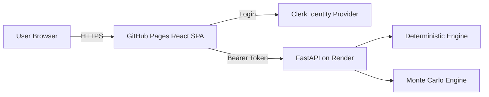

# UK Household Financial Stress Engine
# Final Cloud Deployment Plan (Locked v5 — Implementation Specification)

---

## Document Purpose

This document defines:

- Cloud deployment architecture
- Technology stack definitions
- Infrastructure responsibilities
- API contracts (implementation-only)
- Environment configuration
- CI/CD requirements (frontend + API)
- Definition of Done
- A hardened GitHub Copilot execution prompt

This document intentionally excludes modelling methodology decisions.
Those are handled in the separate MOD (Methodology) specification.

---

# PART I — Cloud Architecture Foundations (IT Concepts)

## 1. Layered Architecture Overview

Modern web applications use a layered structure:

1. **Frontend (Client Application)**
2. **Backend (API Server)**
3. **Authentication Provider**
4. **Hosting Infrastructure**

This separation improves scalability, maintainability, security, and deployment flexibility.

---

## 2. Technology Stack Definitions

### React
A JavaScript library for building component-based user interfaces.

### Vite
A frontend build tool that bundles TypeScript/JavaScript, provides a fast development server, and outputs optimized production assets.

### GitHub Pages
A static hosting platform that serves HTML/CSS/JS files and does not run server-side code. Suitable for frontend SPAs.

### FastAPI
A Python web framework for building REST APIs with automatic validation, structured JSON responses, and OpenAPI schema generation.

### Render
A cloud hosting platform that deploys backend services from GitHub and manages infrastructure automatically.

### Clerk
An authentication provider that manages login/logout and issues JWT tokens. Integrates with React apps and supports OAuth2 / OIDC.

### JWT
A signed token containing user identity claims. The backend verifies JWT signatures using Clerk’s JWKS endpoint.

---

# PART II — Final Locked Architecture

## Components

- React SPA hosted on **GitHub Pages (default URL)**
- Clerk for authentication
- FastAPI backend hosted on Render
- Deterministic engine (server-side)
- Monte Carlo engine (server-side)
- Stateless architecture (no database for PoC)

---

## Architecture Diagram



---

# PART III — API Contracts (Implementation Only)

## 1. Health Endpoint

**GET** `/health`

### Response
```json
{"status":"ok"}
```

---

## 2. Deterministic Endpoint

**POST** `/api/v1/deterministic/run`

### Request
```json
{"input_parameters": { } }
```

### Response (minimum fields)
```json
{
  "runway_months": 12,
  "min_savings": 0.0,
  "month_by_month": [],
  "warnings": []
}
```

---

## 3. Monte Carlo Endpoint

**POST** `/api/v1/montecarlo/run`

### Request Schema
```json
{
  "input_parameters": { },
  "n_sims": 2000,
  "horizon_months": 24,
  "seed": 12345
}
```

### Backend Behaviour
- Validate Clerk JWT
- Validate schema
- Enforce caps and rate limits
- Execute simulations
- Compute percentiles (P10, P50, P90)
- Return structured JSON
- Do **NOT** log raw inputs

### Response Schema
```json
{
  "n_sims": 2000,
  "horizon_months": 24,
  "seed": 12345,
  "runtime_ms": 123.4,
  "metrics": {
    "runway_months": {"p10": 3.0, "p50": 10.0, "p90": 24.0},
    "min_savings": {"p10": 0.0, "p50": 1200.0, "p90": 5000.0},
    "max_monthly_deficit": {"p10": 900.0, "p50": 400.0, "p90": 50.0}
  }
}
```

### Constraints (PoC)
- `MAX_MONTE_CARLO_SIMS <= 2000`
- `MAX_HORIZON_MONTHS <= 120`
- `REQUEST_TIMEOUT_SECONDS` enforced (server-side)
- Percentile computation must be deterministic
- If seed provided → output must be reproducible
- If seed missing → server generates seed and returns it

---

# PART IV — Environment Variables

## Frontend (React)

| Variable | Dev | Prod |
|----------|------|------|
| `VITE_API_BASE_URL` | `http://localhost:8000` | Render API URL |
| `VITE_CLERK_PUBLISHABLE_KEY` | Dev key | Prod key |
| `VITE_APP_BASE_PATH` | `/` | `/<repo-name>/` |

## Backend (FastAPI)

| Variable | Dev | Prod |
|----------|------|------|
| `ENV` | `dev` | `prod` |
| `CORS_ORIGINS` | `http://localhost:5173` | `https://<user>.github.io` |
| `CLERK_JWKS_URL` | Dev JWKS | Prod JWKS |
| `CLERK_ISSUER` | Dev issuer | Prod issuer |
| `MAX_MONTE_CARLO_SIMS` | `2000` | `2000` |
| `MAX_HORIZON_MONTHS` | `120` | `120` |
| `RATE_LIMIT_RPM` | `60` | `60` |
| `REQUEST_TIMEOUT_SECONDS` | `30` | `30` |

---

# PART V — Definition of Done

Deployment is complete when:

- GitHub Pages deployment succeeds on push to `main`
- Clerk authentication blocks protected routes
- FastAPI runs locally and on Render
- `/health` returns `{"status":"ok"}`
- Deterministic endpoint returns valid JSON and UI renders summary
- Monte Carlo endpoint returns P10/P50/P90 and UI renders summary + diagnostics
- No personal data stored or logged

---

# PART VI — CI/CD Requirements (Frontend + API)

## 1. Frontend CI/CD (GitHub Pages)

### Workflow file
`.github/workflows/deploy-pages.yml`

### Triggers
- On push to `main` affecting `apps/web/**`
- Optionally on manual `workflow_dispatch`

### Steps (required)
- Checkout
- Setup Node (LTS)
- Install deps (choose one: `npm ci` or `pnpm install --frozen-lockfile`)
- Build `apps/web`
- Deploy `apps/web/dist` to GitHub Pages

### Quality gates (required)
Before building:
- Typecheck
- Lint
- Unit tests (Vitest)

---

## 2. API CI (required) — tests, lint, typecheck

### Workflow file
`.github/workflows/api-ci.yml`

### Triggers
- On pull_request targeting `main` affecting `services/api/**`
- On push to `main` affecting `services/api/**`

### Steps (required)
- Checkout
- Setup Python 3.11+
- Install API dependencies (prefer `uv` if repo uses it; otherwise pip)
- Run:
  - `ruff` (lint)
  - `pytest` (unit tests)
  - Optional: `mypy` (typecheck) if configured

### Failure behaviour
- Any failed step must fail the workflow.

---

## 3. API CD (recommended) — Render deployment model

### Preferred approach (low-ops)
Use **Render Auto-Deploy** from GitHub:
- Render pulls from `main` and redeploys on new commits.
- CI runs on PRs to protect `main` (via branch protection rules).

### Optional hardening (still simple)
- Add a `render.yaml` blueprint (if desired) to define service config as code.
- Keep secrets (Clerk issuer/JWKS URL, etc.) configured in Render dashboard env vars.

**Note:** Avoid GitHub Actions “deploy-to-Render” scripts in PoC because they require storing deploy API keys/secrets in GitHub. Auto-deploy + CI is simpler and safer.

---

# PART VII — GitHub Copilot Implementation Instructions (Hardened)

## How to use this section
Tell Copilot exactly:

> **“Implement PART VII of this document.”**

Copilot must implement the repository according to PART II–VI and the constraints below.

---

## Copilot Constraints (Do not deviate)
1. **Ask** clarifying questions. Don't implement anything different to what is specified without asking.
2. Keep dependencies minimal.
3. Do not introduce a database or persistence in PoC.
4. Do not log raw inputs or tokens.
5. Use HashRouter and Vite base path suitable for GitHub Pages.
6. Use Clerk for auth; do not implement custom username/password.
7. Server-side executes deterministic + Monte Carlo.
8. Add CI workflows exactly at the specified paths.
9. Create `.env.example` files (frontend and API) and do not commit `.env`.

---

## Required repo structure
```
repo-root/
  apps/
    web/
  services/
    api/
  docs/
  .github/
    workflows/
      deploy-pages.yml
      api-ci.yml
```

---

## Frontend implementation requirements (apps/web)
- Vite + React + TypeScript scaffold
- Routing via `HashRouter`
- Pages:
  - Home (public)
  - Stress Test (protected)
  - Results (protected)
  - About/Disclaimer (public)
- Clerk integration:
  - Sign-in/sign-out UI
  - Route protection wrapper
- API client:
  - Base URL from `VITE_API_BASE_URL`
  - Include `Authorization: Bearer <token>` for API calls
- UX:
  - Non-advisory language (“simulation”, “illustrative”, “not financial advice”)

### Frontend tests
- Use Vitest
- Minimum tests:
  - A protected route denies unauthenticated access (mock auth)
  - API client attaches auth header (unit test)

---

## API implementation requirements (services/api)
- FastAPI app with:
  - `GET /health`
  - `POST /api/v1/deterministic/run`
  - `POST /api/v1/montecarlo/run`
- Auth:
  - Validate Clerk JWT signature using JWKS URL
  - Validate issuer
  - Reject unauthenticated requests with 401
- Validation:
  - Reject invalid input schema with 422
- Safety controls:
  - Enforce caps: `MAX_MONTE_CARLO_SIMS`, `MAX_HORIZON_MONTHS`
  - Enforce `REQUEST_TIMEOUT_SECONDS`
  - Apply simple rate limit (in-memory is acceptable for PoC)
- Monte Carlo outputs:
  - Return exactly the schema in PART III
  - If seed absent: generate and return it
  - Percentiles must be deterministic

### API tests
- Use pytest
- Minimum tests:
  - `/health` returns status ok
  - Auth middleware rejects missing token
  - Deterministic endpoint returns required keys
  - Monte Carlo endpoint returns `metrics` with p10/p50/p90
  - Seed reproducibility: same inputs + same seed → same outputs

---

## CI/CD implementation requirements
- Create GitHub Actions workflows:
  - `.github/workflows/deploy-pages.yml` (build/test/deploy web)
  - `.github/workflows/api-ci.yml` (lint/test API)
- Ensure workflows run only when relevant paths change (path filters).

---

## Acceptance Criteria (Copilot “Done”)
1. `apps/web` builds successfully.
2. GitHub Pages deployment workflow succeeds on `main`.
3. Clerk login works locally in dev mode (via `.env` values).
4. API runs locally and passes all tests.
5. API CI passes on PR.
6. Render auto-deploy is compatible (Dockerfile or start command documented in `services/api/README.md`).

---

# PART VIII — External Deployment Runbook (Manual Actions Outside Repo)

This section defines the actions that must be completed in external platforms.
These cannot be completed by code changes alone.

## Quick Start (15-minute checklist)

1. **Clerk:** create app, enable sign-in method, copy publishable key + issuer + JWKS URL.
2. **Render:** create Web Service from repo `main`, set build/start commands, add API env vars, deploy.
3. **Render health check:** open `https://<render-service>/health` and confirm `{"status":"ok"}`.
4. **GitHub Pages:** set Pages source to GitHub Actions and ensure Actions are enabled.
5. **GitHub build vars:** configure `VITE_API_BASE_URL`, `VITE_CLERK_PUBLISHABLE_KEY`, `VITE_APP_BASE_PATH`.
6. **Trigger deploy:** push to `main` or run `Deploy Web to GitHub Pages` manually.
7. **Smoke test:** open site, sign in via Clerk, run stress test, confirm results render.

## 0. Responsibility split

### Can be done in repo (already handled)
- App code, tests, workflows, and environment templates.
- Path filters and CI definitions.

### Must be done manually by operator
- Clerk tenant/application setup.
- Render service creation and environment variable entry.
- GitHub repository settings for Pages/Actions/environments.
- DNS/custom domain setup (if used).

---

## 1. Clerk setup (authentication provider)

1. Create a Clerk application in Clerk Dashboard.
2. Enable at least one sign-in method (email/password or social).
3. Record the following values:
   - Publishable key (`VITE_CLERK_PUBLISHABLE_KEY`)
   - Issuer URL (`CLERK_ISSUER`)
   - JWKS URL (`CLERK_JWKS_URL`) as `https://<issuer-domain>/.well-known/jwks.json`
4. Configure allowed origins / redirect URLs:
   - `http://localhost:5173`
   - `https://<github-user>.github.io`
   - `https://<github-user>.github.io/<repo-name>` (project pages path)
5. Save changes and verify sign-in works in Clerk hosted UI.

---

## 2. Render setup (FastAPI API hosting)

1. In Render, create **Web Service** from this GitHub repository.
2. Set branch to `main`.
3. Set runtime to Python and configure:
   - Build command: `pip install -U uv && uv sync --all-extras`
   - Start command: `uv run uvicorn services.api.app.main:app --host 0.0.0.0 --port $PORT`
4. Add required environment variables in Render:
   - `ENV=prod`
   - `CORS_ORIGINS=https://<github-user>.github.io`
   - `CLERK_JWKS_URL=<from Clerk>`
   - `CLERK_ISSUER=<from Clerk>`
   - `MAX_MONTE_CARLO_SIMS=2000`
   - `MAX_HORIZON_MONTHS=120`
   - `RATE_LIMIT_RPM=60`
   - `REQUEST_TIMEOUT_SECONDS=30`
5. Trigger first deploy.
6. Verify API health endpoint: `GET https://<render-service>/health` returns `{"status":"ok"}`.

---

## 3. GitHub Pages setup (frontend hosting)

1. In GitHub repo settings, enable **Actions** permissions (if disabled).
2. In **Settings → Pages**, set source to **GitHub Actions**.
3. Confirm workflow file exists: `.github/workflows/deploy-pages.yml`.
4. Push to `main` (or run `workflow_dispatch`) to trigger deployment.
5. Wait for the `Deploy Web to GitHub Pages` workflow to complete.
6. Open published URL and confirm app shell renders.

---

## 4. Frontend runtime configuration in GitHub Actions

The web app requires these runtime values at build time:
- `VITE_API_BASE_URL`
- `VITE_CLERK_PUBLISHABLE_KEY`
- `VITE_APP_BASE_PATH`

Recommended operator action:
1. Add repository/environment variables/secrets in GitHub:
   - Variables: `VITE_API_BASE_URL`, `VITE_APP_BASE_PATH`
   - Secret or variable: `VITE_CLERK_PUBLISHABLE_KEY`
2. Ensure workflow exports them into build environment.
3. Re-run deploy workflow and validate production auth + API calls.

Note: if these are missing at build time, production app may fail to initialize Clerk or call the API.

---

## 5. Post-deploy validation checklist

1. Open GitHub Pages URL.
2. Confirm public routes load (`/`, `/about`).
3. Sign in via Clerk.
4. Open protected route (`/stress-test`) and run simulation.
5. Confirm results route shows deterministic + Monte Carlo payload.
6. Validate API responses for authenticated requests:
   - Deterministic: `POST /api/v1/deterministic/run`
   - Monte Carlo: `POST /api/v1/montecarlo/run`
7. Confirm unauthenticated requests return `401`.

---

## 6. Troubleshooting map (external configuration)

- `401 Unauthorized`:
  - Check `CLERK_ISSUER` and `CLERK_JWKS_URL` in Render.
  - Verify frontend is sending Bearer token.

- CORS error in browser:
  - Check `CORS_ORIGINS` includes `https://<github-user>.github.io`.

- GitHub Pages deploy green but app broken:
  - Missing `VITE_*` variables at build time.
  - Incorrect `VITE_APP_BASE_PATH` for project pages.

- Render deploy fails:
  - Check build/start commands and Python version compatibility.
  - Review Render logs for dependency/runtime errors.

---

## 7. Operational cadence after go-live

- Weekly:
  - Check Render logs for 401/429/5xx spikes.
  - Verify Pages deployment status and user sign-in success.

- Monthly:
  - Rotate keys/secrets if policy requires.
  - Reconfirm CORS/auth settings after any domain change.

- Quarterly:
  - Dependency updates and security review.
  - Re-test full sign-in and simulation flow end-to-end.

---

END OF DOCUMENT

<!-- crossref:start -->
## Related Documents

- [Repository README](../../README.md)
- [Methodology Golden Source](../methodology/methodology_textbook.md)
- [BRD Implementation Plan](brd_implementation_plan.md)
<!-- crossref:end -->

